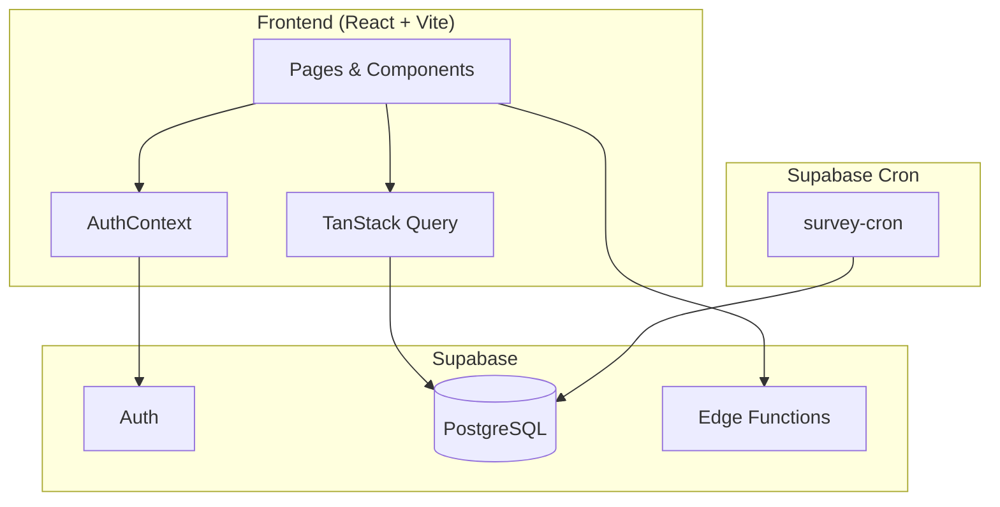

# Kudos Crate

**Система внутренней обратной связи и признаний для сотрудников компании**

[](https://www.typescriptlang.org/)
[](https://reactjs.org/)
[](https://vitejs.dev/)
[](https://supabase.com/)
[](LICENSE)
[](https://github.com/{USER}/{REPO}/actions)

---

## Содержание

- [О проекте](#о-проекте)
- [Технологии](#технологии)
- [Быстрый старт](#быстрый-старт)
- [Конфигурация](#конфигурация)
- [Docker](#docker)
- [Примеры API](#примеры-api)
- [Структура репозитория](#структура-репозитория)
- [Тесты и CI](#тесты-и-ci)
- [Развёртывание](#развёртывание)
- [Вклад в проект](#вклад-в-проект)
- [Лицензия и контакты](#лицензия-и-контакты)
- [Changelog](#changelog)

---

## О проекте

**Kudos Crate** — веб-приложение для управления внутренней обратной связью в компании. Сотрудники могут отправлять обратную связь по рабочим эпизодам, давать kudos коллегам, проходить полугодовые опросы, а руководители — вести дневник и анализировать настроения команды.

### Ключевые особенности

- **Обратная связь** — оценка коллег по рабочим эпизодам с подкатегориями (позитивные/негативные)
- **Kudos** — выражение благодарности коллегам по категориям (помощь, поддержка, наставничество и др.)
- **Полугодовые опросы** — автоматические циклы опросов для сотрудников и руководителей
- **Дневник руководителя** — двухмесячные отчёты менеджеров
- **Настроение компании** — агрегированная аналитика по командам
- **Критические инциденты** — учёт негативных событий (для HR/Admin)
- **Админ-панель** — управление пользователями, командами и эпизодами
- **Роли** — `employee`, `manager`, `hr`, `admin` с разграничением доступа

---

## Технологии

| Слой | Стек |
|------|------|
| **Frontend** | React 18, TypeScript, Vite, React Router, TanStack Query |
| **UI** | shadcn/ui (Radix UI), Tailwind CSS, Lucide Icons |
| **Формы** | React Hook Form, Zod, @hookform/resolvers |
| **Backend** | Supabase (Auth, PostgreSQL, Edge Functions) |
| **Тесты** | Vitest, React Testing Library, jsdom |

---

## Быстрый старт

### Prerequisites

- **Node.js** ≥ 18
- **npm** ≥ 9 (или pnpm/yarn)
- **Supabase** аккаунт (для backend)

### Установка

```bash
# Клонирование репозитория
git clone https://github.com/{USER}/{REPO}.git
cd kudos-crate

# Установка зависимостей
npm install
```

### Запуск локально

```bash
# Разработка (dev-сервер на порту 8080)
npm run dev

# Сборка для production
npm run build

# Превью production-сборки
npm run preview
```

<details>
<summary>Windows PowerShell</summary>

```powershell
git clone https://github.com/{USER}/{REPO}.git
cd kudos-crate
npm install
npm run dev
```
</details>

---

## Конфигурация

### Переменные окружения

Создайте файл `.env` в корне проекта:

```env
# Supabase (обязательные)
VITE_SUPABASE_URL=https://YOUR_PROJECT.supabase.co
VITE_SUPABASE_PUBLISHABLE_KEY=your-anon-key

# Опционально (для Lovable и т.п.)
VITE_SUPABASE_PROJECT_ID=your-project-id
```

**Важно:** Для Supabase Edge Functions требуются переменные `SUPABASE_URL`, `SUPABASE_SERVICE_ROLE_KEY`, `SUPABASE_ANON_KEY` — они задаются в Supabase Dashboard (Settings → Edge Functions).

Пример `.env.example`:

```env
VITE_SUPABASE_URL=
VITE_SUPABASE_PUBLISHABLE_KEY=
VITE_SUPABASE_PROJECT_ID=
```

---

## Docker

### Dockerfile (frontend)

```dockerfile
FROM node:20-alpine AS builder
WORKDIR /app
COPY package*.json ./
RUN npm ci
COPY . .
RUN npm run build

FROM nginx:alpine
COPY --from=builder /app/dist /usr/share/nginx/html
COPY nginx.conf /etc/nginx/conf.d/default.conf
EXPOSE 80
CMD ["nginx", "-g", "daemon off;"]
```

Пример `nginx.conf` для SPA:

```nginx
server {
    listen 80;
    root /usr/share/nginx/html;
    index index.html;
    location / {
        try_files $uri $uri/ /index.html;
    }
}
```

### docker-compose.yml

```yaml
version: "3.9"
services:
  kudos-crate:
    build: .
    ports:
      - "3000:80"
    restart: unless-stopped
```

### Команды

```bash
# Сборка и запуск
docker compose up -d --build

# Остановка
docker compose down
```

---

## Примеры API

Backend реализован через **Supabase** (PostgreSQL REST API и Edge Functions). Основные сущности: `profiles`, `feedback`, `kudos`, `survey_assignments`, `teams`, `work_episodes`, `subcategories`.

### Supabase REST (примеры)

| Метод | Endpoint (относительно `VITE_SUPABASE_URL`) | Описание |
|-------|---------------------------------------------|----------|
| POST | `/rest/v1/kudos` | Создание kudos |
| GET | `/rest/v1/kudos?select=*` | Список kudos |
| POST | `/rest/v1/feedback` | Создание обратной связи |
| GET | `/rest/v1/profiles?select=*` | Список профилей |

**Пример запроса (создание kudos):**

```bash
curl -X POST "https://YOUR_PROJECT.supabase.co/rest/v1/kudos" \
  -H "apikey: YOUR_ANON_KEY" \
  -H "Authorization: Bearer YOUR_JWT" \
  -H "Content-Type: application/json" \
  -H "Prefer: return=representation" \
  -d '{"from_user_id":"...","to_user_id":"...","category":"helped_understand","comment":"Спасибо за помощь!"}'
```

**Пример ответа:**

```json
{
  "id": "uuid",
  "from_user_id": "uuid",
  "to_user_id": "uuid",
  "category": "helped_understand",
  "comment": "Спасибо за помощь!",
  "created_at": "2025-03-01T12:00:00Z"
}
```

### Edge Functions

| Функция | URL | Описание |
|---------|-----|----------|
| admin-users | `POST /functions/v1/admin-users` | Управление пользователями (создание/удаление). Только admin. |
| survey-cron | `/functions/v1/survey-cron` | Cron: создание циклов опросов, обновление просроченных заданий. |

**Пример admin-users (создание пользователя):**

```bash
curl -X POST "https://YOUR_PROJECT.supabase.co/functions/v1/admin-users" \
  -H "Authorization: Bearer ADMIN_JWT" \
  -H "Content-Type: application/json" \
  -d '{"action":"create","email":"user@example.com","full_name":"Иван Иванов","role":"employee","team_id":"uuid"}'
```

---

## Структура репозитория

```
kudos-crate/
├── src/
│   ├── components/       # UI-компоненты (AppLayout, ProtectedRoute, ui/)
│   ├── contexts/         # AuthContext и др.
│   ├── integrations/     # Supabase client и types
│   ├── hooks/            # Хуки (use-mobile, use-toast)
│   ├── lib/              # Утилиты, типы
│   ├── pages/            # Страницы (Login, Dashboard, KudosForm и т.д.)
│   ├── test/             # Настройка тестов
│   ├── App.tsx
│   └── main.tsx
├── supabase/
│   ├── config.toml       # Конфиг Supabase
│   ├── functions/        # Edge Functions (admin-users, survey-cron, seed-data)
│   └── migrations/       # SQL-миграции БД
├── public/
├── index.html
├── package.json
├── vite.config.ts
├── vitest.config.ts
├── tailwind.config.ts
└── tsconfig.json
```

---

## Архитектура



---

## Тесты и CI

### Запуск тестов

```bash
# Одноразовый прогон
npm test

# Watch-режим
npm run test:watch
```

### Lint

```bash
npm run lint
```

### Пример GitHub Actions (CI)

Создайте `.github/workflows/ci.yml`:

```yaml
name: CI
on: [push, pull_request]
jobs:
  build-and-test:
    runs-on: ubuntu-latest
    steps:
      - uses: actions/checkout@v4
      - uses: actions/setup-node@v4
        with:
          node-version: "20"
          cache: "npm"
      - run: npm ci
      - run: npm run lint
      - run: npm test
      - run: npm run build
```

---

## Развёртывание

### Vercel / Netlify (SPA)

1. Подключите репозиторий к Vercel/Netlify.
2. Build command: `npm run build`
3. Output directory: `dist`
4. Добавьте переменные окружения: `VITE_SUPABASE_URL`, `VITE_SUPABASE_PUBLISHABLE_KEY`

### Docker на VPS

```bash
# На сервере
git clone https://github.com/{USER}/{REPO}.git
cd kudos-crate
# Настройте .env
docker compose up -d --build
```

### Lovable (no-code)

Откройте [Lovable](https://lovable.dev) и подключите проект. Деплой через Share → Publish.

---

## Вклад в проект

Мы приветствуем вклад в проект. Краткие правила:

1. Форкните репозиторий и создайте ветку (`git checkout -b feat/amazing-feature`).
2. Внесите изменения. Соблюдайте ESLint и TypeScript strict.
3. Добавьте тесты при необходимости.
4. Сделайте коммит (`git commit -m 'feat: add amazing feature'`).
5. Запушьте ветку и откройте Pull Request.

### Шаблон Pull Request

```markdown
## Описание
Краткое описание изменений.

## Тип изменений
- [ ] feat: новая функциональность
- [ ] fix: исправление бага
- [ ] refactor: рефакторинг
- [ ] docs: документация

## Чек-лист
- [ ] Код проходит lint
- [ ] Добавлены/обновлены тесты
- [ ] Документация обновлена (если нужно)
```

---

## Лицензия и контакты

- **Лицензия:** [MIT](LICENSE)
- **Контакты:** [@maintainer](https://github.com/{USER}) / {MAINTAINER_CONTACT}

---

## Changelog

### [Unreleased]

- *Новые изменения*

### [0.0.0] — 2025-03-01

- Начальная версия
- Feedback, Kudos, Surveys, Leader Diary
- Admin: users, teams, episodes
- Интеграция с Supabase

---

*Демо: {DEMO_LINK}*
